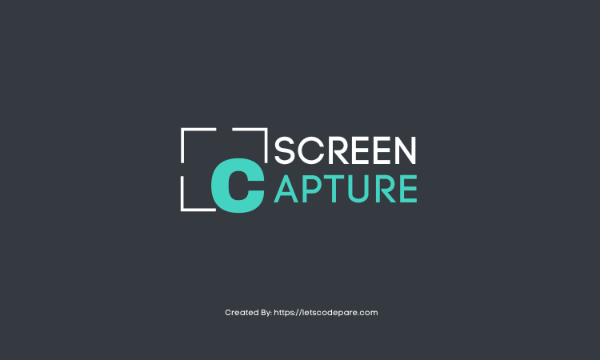

<p align="left">
  
</p>

# Screen Capture Api

> Handle screen capture services to generate images of any website you want.
> Save website page as PNG, PDF etc.

[](https://github.com/letscodepare/screen-capture-api/issues) [](https://github.com/letscodepare) [](#) [](https://github.com/letscodepare/screen-capture-api/stargazers) [](https://github.com/letscodepare/screen-capture-api/network/members) [](https://github.com/letscodepare/screen-capture-api/graphs/contributors)

# :pushpin: Table of Contents

* [Features](#rocket-features)
* [Installation](#construction_worker-installation)
* [Getting Started](#runner-getting-started)
* [FAQ](#question-faq)
* [Contributing](#tada-contributing)
* [License](#closed_book-license)

# :rocket: Features

* :bento: &nbsp; Website Screen Capture.


# :construction_worker: Installation

**You need to install [Node.js](https://nodejs.org/en/download/) and [Yarn](https://yarnpkg.com/) first, then in order to clone the project via HTTPS, run this command:**

```
git clone https://github.com/letscodepare/screen-capture-api.git
```

SSH URLs provide access to a Git repository via SSH, a secure protocol. If you use a SSH key registered in your Github account, clone the project using this command:

```
git clone git@github.com:letscodepare/screen-capture-api.git
```

**Install dependencies**

```
yarn install
```

Or

```
npm install
```

Create your environment variables based on the examples of ```.env.example```

```
cp .env.example .env
```

After copying the examples, make sure to fill the variables with new values.


# :runner: Getting Started

Run the following command in order to start the application in a development environment:

```yarn dev```

# :question: FAQ

**Question:** What are the technologies used in this project?

**Answer:** The technologies used in this project are [NodeJS](https://nodejs.org/en/) + [Express Framework](http://expressjs.com/en/)

# :tada: Contributing

Check out the [contributing](https://github.com/letscodepare/screen-capture-api/blob/master/CONTRIBUTING.md) page to see the best places to file issues, start discussions and begin contributing.

# :closed_book: License

Released in 2021.
This project is under the [MIT license](https://github.com/letscodepare/screen-capture-api/master/LICENSE).

Made with :beers: by [Let's Code Pare](https://github.com/letscodepare) :rocket: